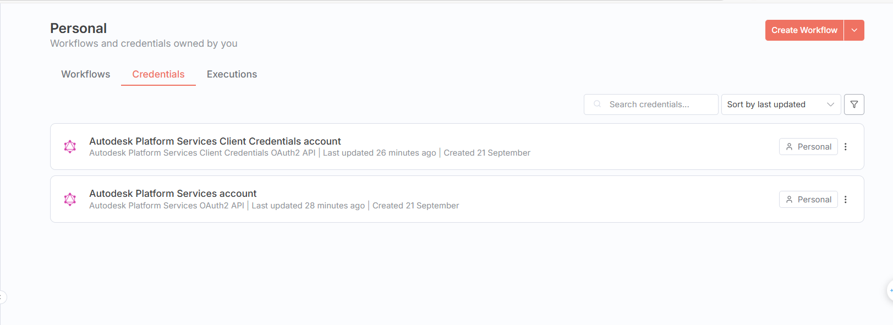
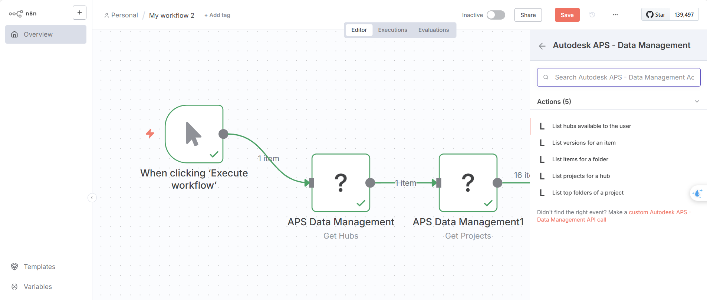

# n8n-nodes-aps

> Autodesk Platform Services (APS, formerly Forge) nodes for n8n.

This community package adds:

- Credentials
  - AutodeskPlatformServicesOAuth2Api (3‑legged OAuth2, Authorization Code)
  - AutodeskPlatformServicesClientCredentialsOAuth2Api (2‑legged OAuth2, Client Credentials)
- Node
  - APS Data Management: read hubs, projects, folders, items, and versions from APS

Both credentials and the node are implemented in TypeScript for n8n 1.x.

## Install

If you have a global n8n installation:

```powershell
# 1) Install dependencies
npm install

# 2) Build
npm run build

# 3) Link this package into your n8n instance
npm link
npm link n8n-nodes-aps

# 4) Restart n8n so it loads the linked package
n8n stop; n8n start
```

Alternatively, add this package to your self-hosted n8n project and restart n8n.

## Configure APS credentials

1) Create an app in the Autodesk Developer Portal and collect your Client ID/Secret.
2) Choose your auth flow:
- 3‑legged OAuth2 (Authorization Code) – recommended for user-specific data like hubs/projects.
- 2‑legged OAuth2 (Client Credentials) – service-to-service; limited access for some endpoints.
3) In n8n, create a new credential using one of:
- AutodeskPlatformServicesOAuth2Api
- AutodeskPlatformServicesClientCredentialsOAuth2Api
4) Scopes: at minimum for reading Data Management, include `data:read`. Add `data:write` or `bucket:*` if needed.

Note: “Get Hubs” typically requires 3‑legged OAuth2 (user-context resource).



## APS Data Management node

Operations:
- Get Hubs: List hubs available to the user
- Get Projects: List projects in a hub (requires Hub ID)
- Get Top Folders: List top-level folders for a project (requires Project ID)
- Get Items: List folder contents (requires Project ID and Folder ID)
- Get Item Versions: List versions for an item (requires Project ID and Item ID)

Options:
- Simplify Output (default: ON)
  - Flattens JSON:API entities to a clean object: `{ id, type, href, ...attributes }`
  - Turn OFF to get raw JSON:API entities (with `attributes`, `links`, `relationships`)
- Split Into Items (default: ON)
  - ON: array responses become multiple n8n items (one per element)
  - OFF: returns a single n8n item; when simplified this is `{ data: [...] }`, otherwise the raw JSON:API response



### Example outputs

- Get Hubs with Simplify=ON, Split=ON → multiple items like:
```json
{
  "id": "b.1715...e72f6",
  "type": "hubs",
  "href": "https://developer.api.autodesk.com/project/v1/hubs/b.1715...e72f6",
  "name": "Testing",
  "region": "US",
  "extension": { "type": "hubs:autodesk.bim360:Account", "version": "1.0", "schema": {"href": "..."}, "data": {} }
}
```

- Get Hubs with Simplify=ON, Split=OFF → single item:
```json
{
  "data": [ { "id": "...", "type": "hubs", "href": "...", "name": "...", "region": "..." } ]
}
```

- Get Hubs with Simplify=OFF, Split=OFF → single item with raw JSON:API:
```json
{
  "jsonapi": { "version": "1.0" },
  "links": { "self": { "href": "https://developer.api.autodesk.com/project/v1/hubs" } },
  "data": [ { "type": "hubs", "id": "...", "attributes": { /* ... */ }, "links": { /* ... */ } } ],
  "meta": { /* ... */ }
}
```

### IDs and URNs
- hubId: from Get Hubs result (`item.id`)
- projectId: from Get Projects result (`item.id`)
- folderId: URN from APS (e.g., `urn:adsk.wipprod:fs.folder:co.xxxx`)
- itemId: URN (e.g., `urn:adsk.wipprod:dm.lineage:xxxx`)

## Troubleshooting
- Invalid URL: The node uses absolute APS URLs; ensure you’re on the latest build and restart n8n.
- JSON shows as string: The node forces JSON mode and parses if needed; update/restart n8n if you still see quoted JSON.
- Client credentials invalid: Use 3‑legged OAuth2 for user-context operations like Get Hubs.
- 403 warnings in `meta`: You may lack access for some BIM 360 regions; check account permissions and app scopes.

## Development
- Lint: `npm run lint`
- Fix lint: `npm run lintfix`
- Build: `npm run build`
- Dev (watch): `npm run dev`
- After building, restart n8n so it reloads the `dist` output.

## License

MIT
